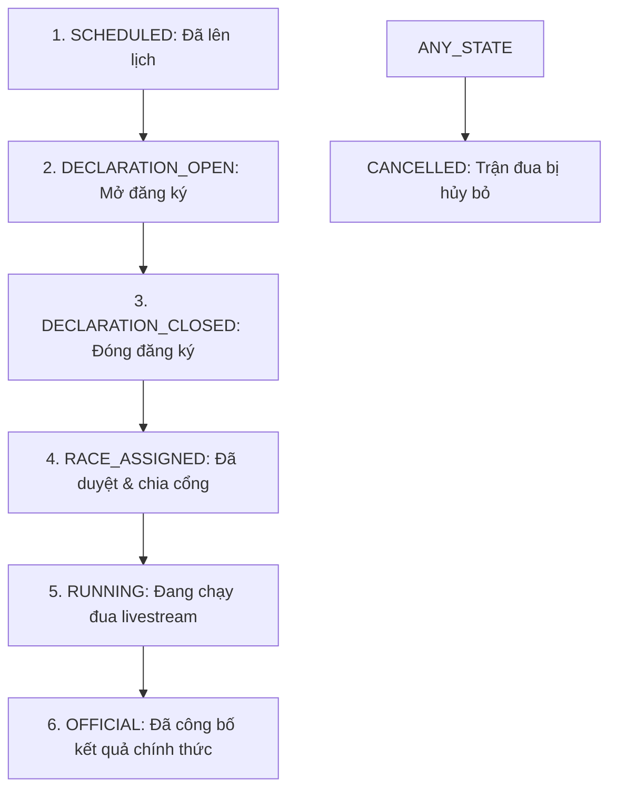

# 🏁 QUY TRÌNH NGHIỆP VỤ HỆ THỐNG ĐUA NGỰA (WORKFLOW)
*Tài liệu hướng dẫn ôn tập bảo vệ đồ án tốt nghiệp / báo cáo môn học*

---

## 1. Vòng đời Trạng thái Trận đua (Race Status Lifecycle)
Một trận đua (`Race`) từ khi được thiết lập đến khi kết thúc sẽ chuyển đổi trạng thái (`status`) qua các bước sau:

*   **`SCHEDULED`**: Trận đua mới được Admin tạo ra và lên lịch thời gian dự kiến chạy.
*   **`DECLARATION_OPEN`**: Trận đua bắt đầu mở cổng đăng ký cho các ngựa thi đấu.
*   **`DECLARATION_CLOSED`**: Đóng cổng đăng ký để chuẩn bị kiểm duyệt danh sách.
*   **`RACE_ASSIGNED`**: Admin/Trọng tài duyệt hồ sơ thi đấu và hệ thống tự động gán số cổng xuất phát (`gate_number`) cho các đấu sĩ.
*   **`RUNNING`**: Trọng tài bấm "Start Race", bắt đầu phát sóng trực tiếp (livestream video) và mở tính năng Live Chat.
*   **`OFFICIAL`**: Trọng tài nhập kết quả về đích của từng ngựa. Hệ thống công bố kết quả chính thức và tự động cộng/trừ điểm xếp hạng (`current_rating`) cho ngựa.
*   **`CANCELLED`**: Trận đua bị hủy do không đủ số ngựa tối thiểu (`min_entries`) hoặc lý do bất khả kháng.

---

## 2. Quy trình Đăng ký & Phê duyệt (Registration & Approval Flow)
Để một cặp **Ngựa + Nài ngựa (Jockey)** có thể tham gia thi đấu chính thức, quy trình được chia làm 3 tầng kiểm duyệt chặt chẽ:

1.  **Đăng ký tham gia sự kiện (Race Meeting)**:
    *   Chủ ngựa (`Owner`) và Nài ngựa (`Jockey`) phải đăng ký tham dự ngày hội đua ngựa (`RaceMeeting`) đó và được Admin phê duyệt.
    *   Chủ ngựa tiếp tục đăng ký danh sách các ngựa (`Horse`) của mình vào sự kiện đó.
2.  **Lời mời thi đấu (Race Invitation)**:
    *   Chủ ngựa lựa chọn một trận đua cụ thể (`Race`) và gửi một **Lời mời thi đấu (`RaceInvitation`)** tới một Nài ngựa (`Jockey`) mong muốn.
    *   Nài ngựa đăng nhập vào hệ thống và chọn **Chấp nhận (`ACCEPT`)** hoặc **Từ chối (`REJECT`)** lời mời.
3.  **Kiểm duyệt của Admin & Khởi tạo lượt đua (`RaceEntry`)**:
    *   Khi nài ngựa chấp nhận, hồ sơ gửi lên Admin kiểm duyệt.
    *   **Nếu Admin đồng ý (`APPROVED`)**: Hệ thống tự động tạo ra một bản ghi trong bảng **`[RaceEntry]`** (chứa liên kết `race_id`, `horse_id`, `jockey_id` và gán ngẫu nhiên số cổng `gate_number`).
    *   **Nếu Admin từ chối (`REJECTED`)**: Chủ ngựa có thể tạo hồ sơ mới hoặc gửi lại yêu cầu sửa đổi (resubmit).

---

## 3. Khởi chạy & Phát sóng trực tiếp (Livestreaming & Real-time Chat)
*   Khi Trọng tài (Referee) nhấn **"Start Race"**, trạng thái trận đấu cập nhật sang **`RUNNING`**.
*   **Giao thức truyền thông (Protocol)**: 
    *   Hệ thống sử dụng **WebSocket** (qua lớp xử lý `ChatWebSocketHandler.java` ở Backend) để duy trì kết nối hai chiều liên tục giữa trình duyệt khán giả và server.
    *   Nhờ WebSocket, khán giả có thể xem livestream và chat trực tuyến (Live Chat) tương tác với nhau ngay lập tức (Real-time) mà không cần phải tải lại trang (reload page).

---

## 4. Công bố kết quả & Kết thúc giải đấu (Publishing Results & Ratings)
*   Khi trận đấu kết thúc, trọng tài nhập kết quả: thứ hạng về đích (`final_position`) và thời gian chạy (`finish_time`).
*   Các thông tin này được cập nhật trực tiếp vào bảng **`[RaceEntry]`**.
*   Trận đấu chuyển sang trạng thái cuối cùng là **`OFFICIAL`**.
*   Hệ thống tự động kích hoạt tiến trình cập nhật phong độ: tính toán tăng/giảm điểm rating (`current_rating`) cho ngựa và nài ngựa dựa trên vị trí về đích của chúng.
